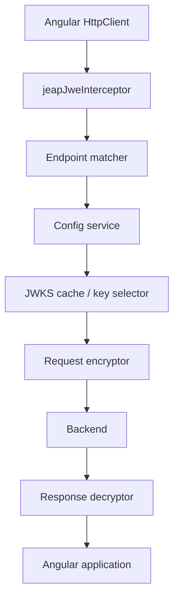
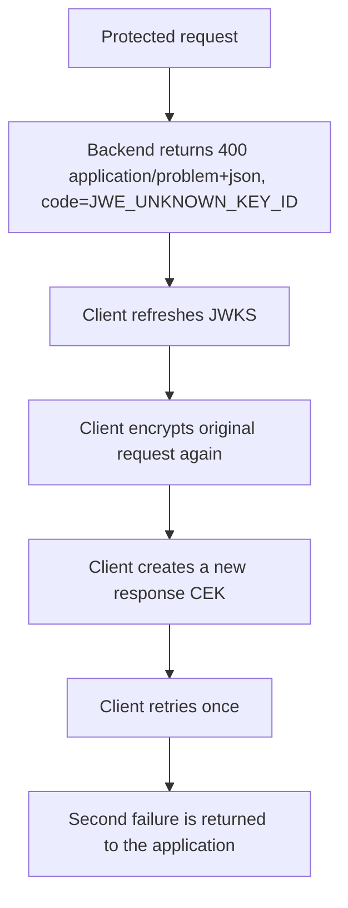

# Architecture

`jeap-jwe-client` is organized around a functional Angular HTTP interceptor and a small set of focused services.

## High-level flow



## Components

### `jeapJweInterceptor`

The interceptor is the main entry point. It decides whether a request is protected, delegates encryption, forwards the request, and decrypts encrypted responses.

It also handles the retry flow for the retryable backend error `JWE_UNKNOWN_KEY_ID`.

### Endpoint matcher

The matcher checks:

- whether the request targets the configured backend origin,
- whether the path matches an include pattern,
- whether the path matches an exclude pattern (excludes win).

A request is protected only when it matches an include and no exclude — the same decision the backend filter makes. Patterns are simple paths (no HTTP method) and matched against the request path relative to the origin root. Query parameters are ignored.

### Config service

The config service combines local Angular configuration with optional backend metadata from `/.well-known/jwe-configuration`. When the backend publishes `includedPaths`/`excludedPaths`, those are used as the source of truth for the include/exclude decision (the backend's `excludedPaths` already contains the jEAP defaults); the local `exclude` patterns are appended on top. When the backend does not publish them, the local `include` (or the default `/*api*/**`) and the local + default excludes apply.

It caches the backend config load and avoids loading backend config for requests that are not protected locally (not included, or locally excluded).

### JWKS client

The JWKS client loads public JWKs through `HttpBackend` so JWKS loading does not trigger the JWE interceptor.

It validates that keys are public RSA encryption keys using the expected algorithm.

### JWKS cache

The cache stores the latest valid JWKS snapshot. Refreshes are atomic: the current snapshot is replaced only after a valid JWKS response was loaded and validated.

### Key selector

The key selector uses `keys[0]` as the current key for new requests. It never sorts or reorders backend keys.

For unknown key situations it can refresh JWKS and select from the updated snapshot.

### Request encryptor

The request encryptor:

- serializes supported JSON bodies,
- creates a request-local response CEK,
- encrypts `JWE-Response-Key`,
- encrypts the request body when present,
- forces transport response type to `text`,
- stores the original Angular response type in request context.

### Response decryptor

The response decryptor only decrypts responses with `Content-Type: application/jose`.

It validates response JWE algorithms, decrypts with the request-local CEK, deserializes JSON/text responses, and restores the original content type.

## Request context

Every protected request carries a request-local context internally:

```text
original response type
original request content type
response CEK
matched endpoint information
```

The response CEK must never be logged, persisted, cached globally, or exposed outside the request/response pipeline.

## Retry flow



There is no retry loop.
