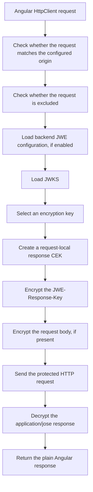

# Getting started

`jeap-jwe-client` adds transparent JWE request and response protection to Angular `HttpClient` calls.

Your application code keeps using normal Angular request and response types. The library changes only the HTTP transport format between the Angular application and the configured backend.

For all configuration options, see [Configuration](./configuration.md).

## What you get

With `jeap-jwe-client` enabled:

- requests to the configured backend origin are protected automatically
- request bodies are encrypted when a body is present
- every protected request sends a `JWE-Response-Key`
- encrypted `application/jose` responses are decrypted automatically
- excluded endpoints are forwarded unchanged
- requests to other backend origins are ignored

Your Angular code still looks like normal `HttpClient` code.

```ts
http.post<Person>('/api/persons', {
  name: 'Alice',
});
```

The library handles the JWE transport internally.

## Installation

```bash
npm install jeap-jwe-client jose
```

## Minimal setup

Register the JWE client configuration and the functional Angular HTTP interceptor.

```ts
import {ApplicationConfig} from '@angular/core';
import {provideHttpClient, withInterceptors} from '@angular/common/http';
import {
  jeapJweInterceptor,
  provideJeapJweClient,
} from 'jeap-jwe-client';

export const appConfig: ApplicationConfig = {
  providers: [
    provideJeapJweClient({
      origin: 'https://api.example.ch',
    }),
    provideHttpClient(withInterceptors([jeapJweInterceptor])),
  ],
};
```

This is enough when the backend exposes the default discovery endpoints:

```text
GET /.well-known/jwe-config
GET /.well-known/jwks.json
```

Both URLs are resolved against the configured `origin`.

For example, with this configuration:

```ts
provideJeapJweClient({
  origin: 'https://api.example.ch',
});
```

the client loads:

```text
https://api.example.ch/.well-known/jwe-config
https://api.example.ch/.well-known/jwks.json
```

## Backend requirements

The backend must provide:

1. a JWE configuration endpoint, unless backend configuration loading is disabled
2. a JWKS endpoint with public encryption keys
3. support for protected `application/jose` requests and responses

By default, the Angular client first loads:

```text
GET /.well-known/jwe-config
```

The backend configuration can tell the client where the JWKS is located and which endpoints should be excluded from JWE protection.

A typical backend configuration looks like this:

```json
{
  "jwksUri": "/.well-known/jwks.json",
  "refreshIntervalSeconds": 300,
  "exclude": [
    {
      "method": "*",
      "path": "/actuator/**"
    }
  ]
}
```

## Frontend-only configuration or backend-provided configuration

You can configure the client in two main ways.

### Backend-provided configuration

This is the default mode.

The Angular application provides only the backend `origin`. The client then loads additional configuration from the backend.

```ts
provideJeapJweClient({
  origin: 'https://api.example.ch',
});
```

Use this mode when the backend should centrally publish JWE-related settings such as the JWKS URI and backend-owned exclude rules.

### Frontend-only configuration

You can also configure the Angular client fully in the frontend.

```ts
provideJeapJweClient({
  origin: 'https://api.example.ch',
  loadBackendConfig: false,
  jwksPath: '/.well-known/jwks.json',
  exclude: [
    {method: '*', path: '/public/**'},
  ],
});
```

In this mode, the client does not call `/.well-known/jwe-config`. The Angular configuration defines the JWKS path and local exclude rules.

The backend is still responsible for exposing the JWKS endpoint and for processing encrypted requests and responses.

### Combined configuration

You can also combine both approaches.

The backend can provide shared excludes, and the frontend can add application-specific excludes. By default, local excludes and backend excludes are combined.

```ts
provideJeapJweClient({
  origin: 'https://api.example.ch',
  exclude: [
    {method: 'GET', path: '/local-public/**'},
  ],
});
```

For details, see [Exclude merge strategy](./configuration.md#exclude-merge-strategy).

## What happens on the first protected request

For a protected request to the configured backend origin, the client performs this flow:



The application receives the same type it requested. The encrypted transport format is not exposed to application code.

## Example POST

Application code:

```ts
http.post<Person>('/api/persons', {
  name: 'Alice',
});
```

Transport request sent to the backend:

```http
POST /api/persons
Accept: application/jose
Content-Type: application/jose
JWE-Response-Key: <compact-jwe>

<compact-jwe-request-body>
```

The original JSON payload is encrypted into the request body. The backend decrypts it and processes normal JSON internally.

The `JWE-Response-Key` contains a request-local content encryption key. The backend uses this key to encrypt the response for this request.

## Example GET

Application code:

```ts
http.get<Person>('/api/persons/123');
```

Transport request sent to the backend:

```http
GET /api/persons/123
Accept: application/jose
JWE-Response-Key: <compact-jwe>
```

There is no encrypted request body for `GET`, but the backend still needs the `JWE-Response-Key` to encrypt the response.

## HTTP headers vs JWE protected headers

The transport request contains normal HTTP headers, for example:

```http
Accept: application/jose
Content-Type: application/jose
JWE-Response-Key: <compact-jwe>
```

These headers are part of the HTTP request.

Inside each compact JWE, there is also a JWE protected header. It contains cryptographic metadata such as:

```json
{
  "alg": "RSA-OAEP-256",
  "enc": "A256GCM",
  "kid": "test-key-1",
  "cty": "application/json"
}
```

The JWE protected header describes how the JWE was encrypted. It is authenticated as part of the JWE. If it is changed, decryption or validation fails.

Common fields are:

| Field | Meaning                               |
|-------|---------------------------------------|
| `alg` | Key management algorithm              |
| `enc` | Content encryption algorithm          |
| `kid` | Key identifier from the JWKS          |
| `cty` | Content type of the encrypted payload |

## Excluded endpoints

Some endpoints are excluded by default:

```text
/.well-known/**
/actuator/**
/health
```

Excluded requests are forwarded unchanged.

For locally excluded endpoints:

- no backend JWE configuration is loaded
- no JWKS is loaded
- no `Accept: application/jose` header is added
- no `JWE-Response-Key` header is added
- no request body encryption is performed

This is important for bootstrapping endpoints such as `/.well-known/jwe-config` and `/.well-known/jwks.json`.

## Next steps

After the minimal setup works, see [Configuration](./configuration.md) for:

- changing discovery paths
- disabling backend configuration loading
- adding exclude rules
- changing exclude merge behavior
- understanding origin matching
