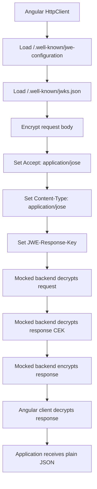
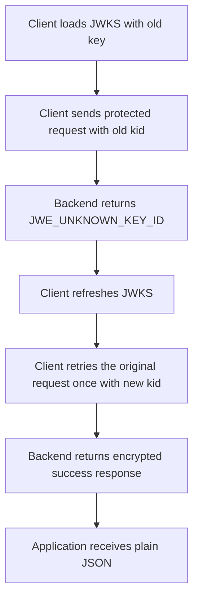
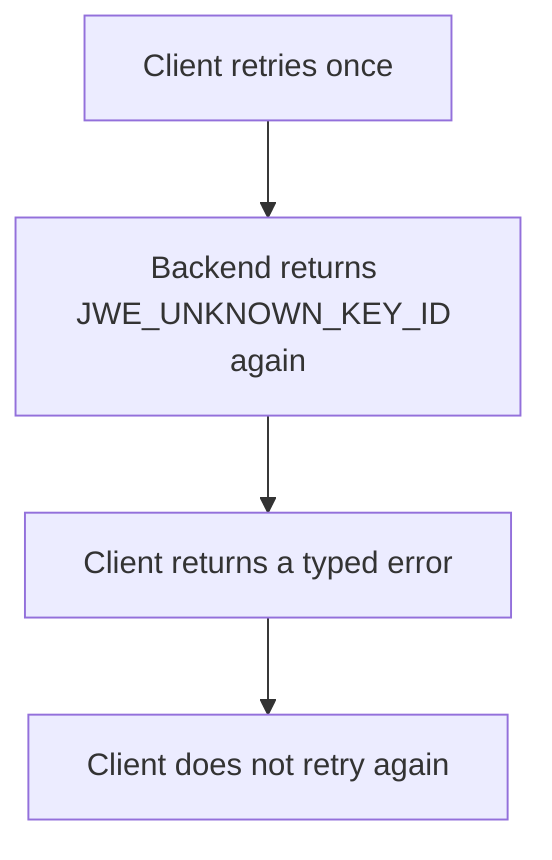
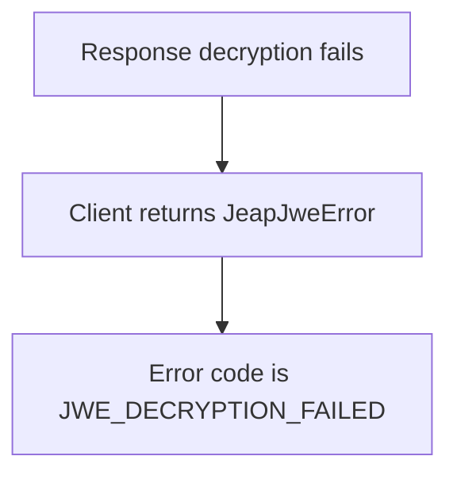

# Testing

`jeap-jwe-client` uses focused unit tests and protocol-level integration tests.

The goal is to test both sides of the client behavior:

1. small implementation details, such as matching, configuration, caching, and error mapping,
2. the full JWE request and response flow as Angular code experiences it.

## Unit test areas

| Area             | What to test                                                               |
|------------------|----------------------------------------------------------------------------|
| Interceptor      | Protected requests, excluded requests, response path, retry handling       |
| Endpoint matcher | Origin matching, path matching, wildcard rules, method matching            |
| Config loader    | Backend config loading, local config, disabled backend config loading      |
| JWKS             | Loading, validation, cache behavior, refresh, key selection                |
| Crypto           | Request encryption, response decryption, wrong key, unsupported algorithms |
| Response CEK     | Header exists, request-local key, `GET` without body                       |
| Errors           | Unknown key id, malformed JWE, decryption failure                          |

## Integration tests

Integration tests use Angular `HttpTestingController` and real crypto.

They do not start a real backend. Instead, the test backend simulates the server-side protocol behavior inside the test.

This gives the test realistic cryptographic coverage while keeping it fast and deterministic.

## POST happy path flow

The POST happy path should cover the full request and response lifecycle:



This test proves that application code can keep using plain Angular request and response types while the transport is protected.

## GET happy path flow

A protected `GET` request has no encrypted request body, but it still needs response encryption.

The test should verify that the request contains:

```http
Accept: application/jose
JWE-Response-Key: <compact-jwe>
```

The request should not contain:

```http
Content-Type: application/jose
```

unless a body is actually present.

The mocked backend should decrypt the `JWE-Response-Key`, encrypt the response, and return an `application/jose` response body.

## Excluded endpoint flow

Excluded endpoints must be forwarded unchanged.

A test for an excluded endpoint should verify that:

- no backend JWE configuration is loaded,
- no JWKS is loaded,
- no `Accept: application/jose` header is added,
- no `JWE-Response-Key` header is added,
- no request body encryption is performed,
- the plain backend response is passed through unchanged.

Example excluded endpoint:

```text
/actuator/health
```

Note that the configuration and JWKS requests are not relevant to exclude handling: the client issues them through Angular's `HttpBackend` directly, so they always bypass the interceptor and are never encrypted, regardless of excludes.

## Retry after unknown key

The client should handle retryable key errors without creating an infinite retry loop.

A typical test flow is:



The test should also verify the negative case:



## Wrong response CEK

The backend must encrypt the response with the request-local response CEK from the same request.

A test should intentionally encrypt the response with the wrong CEK and verify that the client returns a typed decryption error.

Expected behavior:



## Test utilities

Recommended structure:

```text
src/lib/testing/
  jwe-test-fixtures.ts
  jwe-test-keys.ts
  jwe-test-backend.ts
  jwe-test-trace.ts
```

### `jwe-test-fixtures.ts`

Contains shared test constants and simple DTOs.

Examples:

- API paths,
- discovery paths,
- sample request payloads,
- sample response payloads.

### `jwe-test-keys.ts`

Creates runtime RSA test key pairs.

Private key material is generated during the test run and is never committed to the repository.

Use this file for:

- valid test JWKS,
- outdated JWKS,
- replacement keys,
- wrong-key scenarios.

### `jwe-test-backend.ts`

Provides helpers that simulate backend protocol behavior.

Useful helpers include:

- flushing backend configuration,
- flushing JWKS,
- expecting protected requests,
- checking JWE transport headers,
- decrypting request bodies,
- decrypting `JWE-Response-Key`,
- flushing encrypted responses,
- returning `JWE_UNKNOWN_KEY_ID`,
- returning malformed or unsupported JWE responses.

### `jwe-test-trace.ts`

Provides the protocol-trace helper used by the integration spec to print a step-by-step, redacted view of the JWE flow. See [Protocol trace](#protocol-trace) for what it shows and what it must redact.

## Protocol trace

The integration spec can contain a local trace flag:

```ts
const ENABLE_PROTOCOL_TRACE = false;
```

Enable it locally to see traces:

```ts
const ENABLE_PROTOCOL_TRACE = true;
```

Do not commit enabled traces.

The trace should be useful for humans, not just for debugging. It should show the protocol flow step by step.

A good trace can show:

- backend configuration loading,
- JWKS loading,
- selected `kid`,
- request method and URL,
- request headers,
- compact JWE metadata,
- JWE protected header metadata,
- backend decryption result shape,
- encrypted response metadata,
- final Angular response shape.

The trace must redact:

- compact JWE values,
- CEKs,
- private keys,
- full JWK modulus values,
- decrypted `JWE-Response-Key` values,
- real plaintext payloads.

Use placeholders such as:

```text
<compact-jwe length=...>
<redacted 32 bytes>
<redacted>
```
